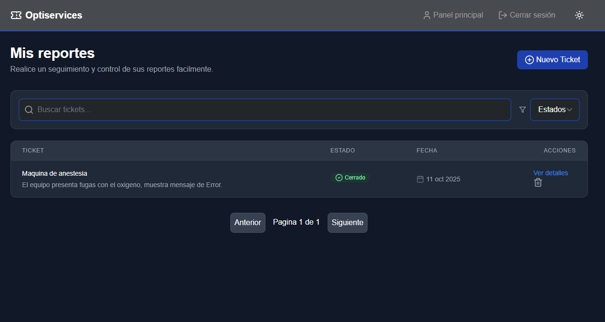
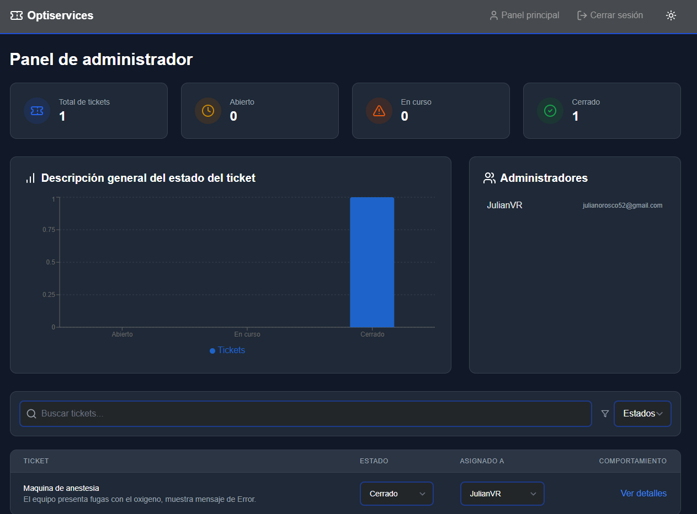

# Sistema de tickets para generar reportes y mantenimiento


## Sobre nosotros
The **Optiservices** Es una aplicación  full-stack creada para generar reportes en tiempo real y que asi mismo estos se puedan resolver de amnera rapida. Los USUARIOS pueden crear, ver y eliminar sus tickets subidos para que los administradores los gestionen. Por otro lado los ADMINISTRADORES pueden modificar estos tickets ya sea añadiendoles un estado o asignándoselos a alguna persona de personal.

## Características
- **Roles de usuario**: Autenticación de acuerdo al rol (admin/user)
- **Gestión de tickets**: Los usuarios pueden crear, ver y eliminar sus tickets.
- **Panel de administrador**: Consulta todos los tickets, actualiza su estado y filtra por progreso.
- **Analisis**: Estadísticas de tickets en tiempo real
- **Autenticación JWT**: Inicio de sesión y control de acceso seguros.
- **Tema claro-oscuro**: DIseñado con Tailwind para preferencia y comodidad del usuario

## Tech Stack
- **Frontend**: React, Tailwind CSS, React Router
- **Backend**: Node.js, Express.js, MongoDB, Mongoose
- **Autenticación**: JWT (JSON Token web)
- **Gestión de estados**:API de contexto
- **Gráficos y análisis**: Recharts

## Instalación y configuración
### 1️. Clonar el repositorio

### 2️. Instalar dependencias
** Backend**
```sh
cd backend
npm install
```
** Frontend**
```sh
cd frontend
npm install
```
### 3️. Configurar variables de entorno
Crear un archivo .env en el directorio backend y agregar:
```sh
MONGO_URI=la_URL_de_conexión_de_tu_MongoDB
JWT_SECRET=Tu_llave_secreta
PORT=5000
```
### 4️. Ejecutar la aplicación
** Backend**
```sh
cd backend
nodemon server.js
```
** Frontend**
```sh
cd frontend
npm run dev
```
##  API Endpoints

###  Autenticación
| Método | Endpoint          |       Descripcion                          |
|--------|-------------------|--------------------------------------------| 
| POST   | /api/auth/sign up | Registrar un nuevo usuario                |
| POST   | /api/auth/login   | Iniciar sesion de usuario y obtener token  |

###  Tickets
| Método | Endpoint               | Descripcion                             |
|--------|------------------------|-----------------------------------------|
| GET    | /api/tickets           | Obtener todos los tickets (Admin)       |
| GET    | /api/tickets/user      | Obtener los tickets de los usuarios     |
| POST   | /api/tickets           | Crear un nuevo ticket (User)            |
| PUT    | /api/tickets/:id       | Actualizar el estado del ticket (Admin) |
| DELETE | /api/tickets/:id       | Borrar un ticket (User)                 |

##   Pantallazos
| Panel de usuario | Panel de administrador |
|------------------|------------------------|
|  |  |

##  Licencia
Este proyecto tiene **Licencia MIT**. Mira la `LICENSE` Para mas detalles.

---
Hecho por [Julian Andres Orosco Paez, Maria Alejandra Amaya Meló y Diego Andres Moya Rincón](https://github.com/julianorosco52)


