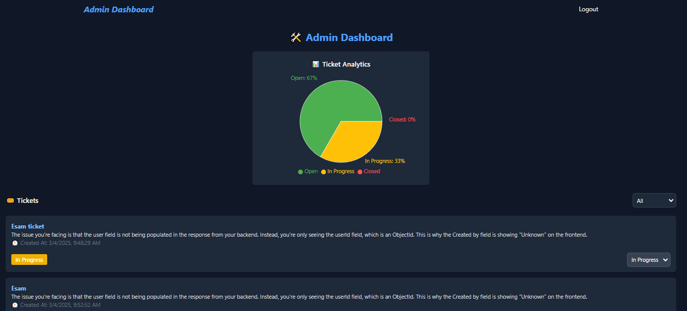

# 🎟️ Ticketing System


## 📌 About
The **Ticketing System** is a full-stack web application designed to streamline corporate issue tracking. Users can **create, view, and manage tickets**, while administrators can **assign statuses and track analytics**. The system features authentication, role-based access, and an intuitive UI.

## ✨ Features
- 🏷️ **User Role Management**: Authentication with role-based access (User/Admin).
- 📝 **Ticket Management**: Users can create, view, and delete their tickets.
- 📊 **Admin Dashboard**: View all tickets, update status, and filter by progress.
- 📈 **Analytics**: Real-time ticket statistics using **Recharts**.
- 🔒 **JWT Authentication**: Secure login and access control.
- 🎨 **Dark-Themed UI**: Designed with **Tailwind CSS** for a professional look.

## 🚀 Tech Stack
- **Frontend**: React, Tailwind CSS, React Router
- **Backend**: Node.js, Express.js, MongoDB, Mongoose
- **Authentication**: JWT (JSON Web Token)
- **State Management**: Context API
- **Charts & Analytics**: Recharts

## 🛠️ Installation & Setup
### 1️⃣ Clone the Repository
```sh
git clone https://github.com/yourusername/ticketing-system.git
cd ticketing-system
```
### 2️⃣ Install Dependencies
```sh
cd backend
npm install
```
### 2️⃣ Install Dependencies
** Backend**
```sh
cd backend
npm install
```
** Frontend**
```sh
cd frontend
npm install
```
### 3️⃣ Configure Environment Variables
Create a .env file in the backend directory and add:
```sh
MONGO_URI=your_mongodb_connection_string
JWT_SECRET=your_secret_key
PORT=5000
```
### 4️⃣ Run the Application
** Backend**
```sh
cd backend
nodemon server.js
```
** Frontend**
```sh
cd frontend
npm run dev
```
## 🔥 API Endpoints

### 🔑 Authentication
| Method | Endpoint           | Description           |
|--------|-------------------|----------------------|
| POST   | /api/auth/signup  | Register a new user  |
| POST   | /api/auth/login   | Login user & get token |

### 🎟️ Tickets
| Method | Endpoint               | Description                         |
|--------|------------------------|-------------------------------------|
| GET    | /api/tickets           | Get all tickets (Admin)            |
| GET    | /api/tickets/user       | Get user's tickets                 |
| POST   | /api/tickets           | Create a new ticket (User)         |
| PUT    | /api/tickets/:id       | Update ticket status (Admin)       |
| DELETE | /api/tickets/:id       | Delete a ticket (User)             |

## 🎨 Screenshots
| User Dashboard | Admin Dashboard |
|---------------|----------------|
|  |  |

## 🤝 Contribution
Contributions are welcome! Please follow these steps:
1. **Fork** the repository.
2. **Create a new branch** (`feature-name`).
3. **Commit your changes** (`git commit -m "Add new feature"`).
4. **Push** to your fork and create a **Pull Request**.

## 📝 License
This project is **MIT Licensed**. See the `LICENSE` file for more details.

---
Made with ❤️ by [Esamel Sabir](https://github.com/Esam-jr)


